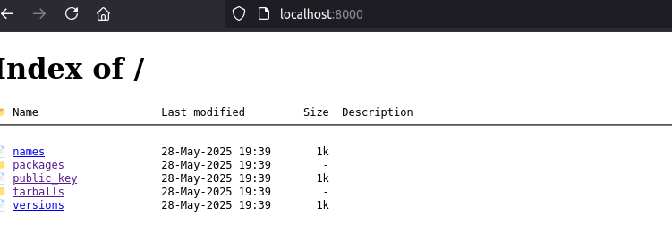

# hex_tiny & hex_beefy

Two containerized Hex package repository/api images for testing and development.

## Table of Contents

- [Overview](#overview)
- [Quick Start](#quick-start)
  - [hex_tiny](#hex_tiny)
  - [hex_beefy](#hex_beefy)
- [CI/CD Integration](#cicd-integration)
- [Why?](#why)

## Overview

**hex_tiny** - A lightweight single-image Hex repository server based on the [Hex: Self Hosting](https://hex.pm/docs/self-hosting) guide. Perfect for private repositories.
- Docker Hub: [camatcode/hex_tiny](https://hub.docker.com/r/camatcode/hex_tiny)
- Port: 8000

**hex_beefy** - A full-featured test environment running [hexpm/hexpm](https://github.com/hexpm/hexpm/tree/main) with integrated PostgreSQL database.
- Docker Hub: [camatcode/hex_beefy](https://hub.docker.com/r/camatcode/hex_beefy)  
- Port: 4000

## Quick Start

### hex_tiny

**Direct Docker:**
```bash
docker run -it --network=host camatcode/hex_tiny
# Or specify port: docker run -it -p {port}:8000 camatcode/hex_tiny
```

**Docker Compose:**
```bash
# Start
docker compose -f docker-compose_tiny.yml up -d

# View logs
docker compose -f docker-compose_tiny.yml logs -f

# Stop
docker compose -f docker-compose_tiny.yml down
```

Access at: http://localhost:8000/



### hex_beefy

**Direct Docker:**
```bash
docker run -it --network=host camatcode/hex_beefy
# Or specify port: docker run -it -p {port}:4000 camatcode/hex_beefy
```

**Docker Compose:**
```bash
# Start
docker compose -f docker-compose_beefy.yml up -d

# View logs
docker compose -f docker-compose_beefy.yml logs -f

# Stop
docker compose -f docker-compose_beefy.yml down
```

Access at: http://localhost:4000/


**Test emails:** http://localhost:4000/sent_emails

## CI/CD Integration

Example usage in GitHub Actions: [aura's workflow](https://github.com/camatcode/aura/blob/main/.github/workflows/ci.yml#L27)

## Why

I needed this to use as a reference API implementation to execute against (because testing against Hex.pm itself is rude).

My CI/CD in this case is really limited (can't compose or launch services), so everything had to work in one image.
