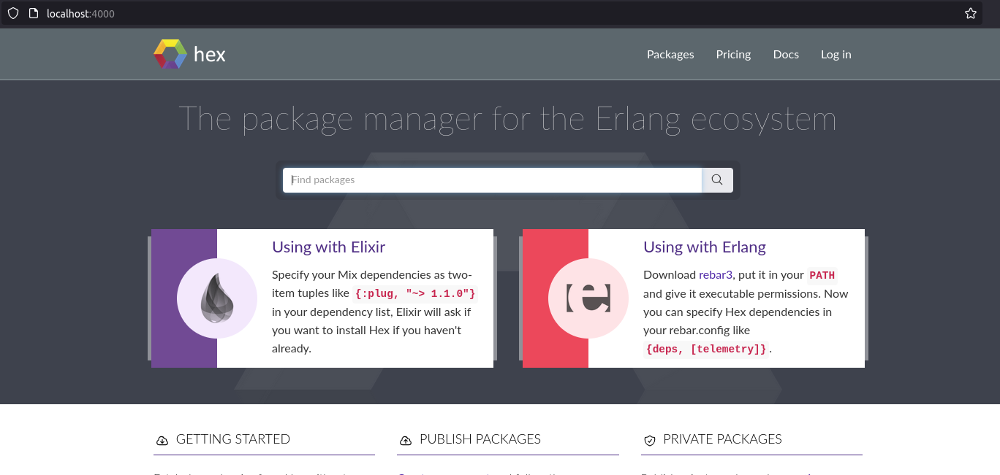

# hex_tiny & hex_beefy


* **hex_tiny** is a single image containing "repository" functionality of private hex repos. It is as if you followed [Hex: Self Hosting](https://hex.pm/docs/self-hosting) and containerized it.
  * published on docker hub as [camatcode/hex_tiny](https://hub.docker.com/r/camatcode/hex_tiny)
* **hex_beefy** is a single image containing [hexpm/hexpm](https://github.com/hexpm/hexpm/tree/main) running in a **test** environment, with an internal postgres already set up.
  * published on docker hub as [camatcode/hex_beefy](https://hub.docker.com/r/camatcode/hex_beefy)

----

### hex_tiny 

#### docker

```sh
docker run -it  --network=host  camatcode/hex_tiny #you can use -p {port}:8000 instead to control the port
```

#### docker compose 

```sh
# to start in daemon mode
docker compose  -f docker-compose_tiny.yml up -d
#[+] Running 1/1
# ✔ Container hex_tiny  Started                                                                                                                                                                                                          0.1s 

# To follow logs
docker compose  -f docker-compose_tiny.yml logs -f

# To down
docker compose  -f docker-compose_tiny.yml down
```

----

### hex_beefy

#### docker

```sh
docker run -it  --network=host  camatcode/hex_beefy #you can use -p {port}:4000 instead to control the port
```


#### docker compose
```sh
# to start in daemon mode
docker compose  -f docker-compose_beefy.yml up -d
#[+] Running 1/1
# ✔ Container hex_beefy  Started                                                                                                                                                                                                          0.1s 

# To follow logs
docker compose  -f docker-compose_beefy.yml logs -f

# To down
docker compose  -f docker-compose_beefy.yml down
```

### Use a web-browser http://localhost:4000/



--------
### Motivations

I needed this to use as a reference API implementation to execute against (because testing against Hex.pm itself is rude).

My CI/CD in this case is really limited (can't compose or launch services), so everything had to work in one image.
